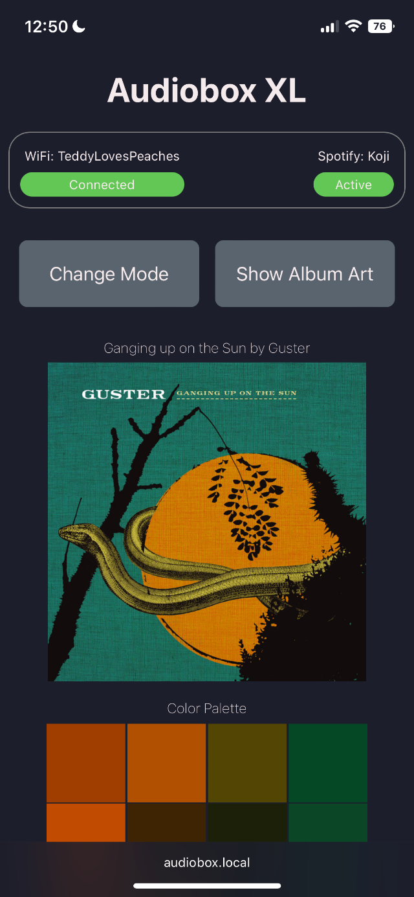

#  Audiobox XL

Audiobox XL is a music-reactive LED box with Spotify integration.

## Features
- Display album art corresponding to the music playing on a linked Spotify account
- Extract the color palette from the current album art and use it to color visualizations
- Display a variety of FFT-based music visualizations using an external microphone
- Automatically adjust the physical LED panel position for diffuse vs sharply defined art
- Two push-buttons for mode control
- Browser-based UI for control and setup
- Command line interface for setup

<figure>
<figcaption><i>Album art and lava lamp displays for the album "Ganging Up on the Sun" by Guster</i></figcaption>

</figure>

<figure>
<figcaption><i>Music-reactive displays</i></figcaption>

</figure>

## Software Design
### Tasks
Seven [FreeRTOS](https://www.freertos.org/) tasks are utilized to separate various control loops. A global event handler object manages communication between tasks. Tasks can independently emit messages to the event handler object, which then passes messages back to tasks that have subscribed to specific message types. In this way, no task needs to communicate directly with another -- all inter-task communication happens via the event handler.

Note that only the Spotify task is pinned to CORE0 (the ESP32 ), all others to CORE1. Empirically, the Spotify task has proven to be significantly more stable on CORE0, perhaps due to the WiFi libraries also running there.

### Spotify Integration
[Spotify's Web API](https://developer.spotify.com/documentation/web-api/) provides music playback information pertaining to the currently linked user account. The authorization flow utilized requires a Spotify user to log in and allow the application to read the "user-read-playback-state" and "user-read-playback-position" information.

### Control
The browser-based UI is served directly from the ESP32 using the [ESPAsyncWebServer](https://github.com/me-no-dev/ESPAsyncWebServer) library. Server-sent-events (SSE) are used to update the UI contents in realtime as audio tracks change.

<figure>
<figcaption><i>Desktop browser UI</i></figcaption>

<figcaption><i>Mobile browser UI</i></figcaption>

</figure>

### Color Palettes

Color palette generation uses a "mean cut" algorithm (similar to [median cut](https://en.wikipedia.org/wiki/Median_cut)) to recursively sort and split groups of pixels at their mean (e.g. average R, G, and B). This results in "buckets" of pixels with similar colors. The average of the pixels in each final bucket approximate the most dominant colors in the input image. By default the algorithm runs to a depth of 4, resulting in 2^4 = 16 final colors.

<figure>
<figcaption><i>Example color palettes</i></figcaption>

</figure>

### Memory Allocation 
In general the code in this project makes use of static memory allocation and avoids use of Arduino Strings where possible. However, the memory for album art jpgs, ArduinoJson objects for Spotify response parsing, and the LEDNoisePattern object are allocated on the heap. The event handler task can optionally dump the maximum stack usage for each task, allowing for fine-tuning of stack allocation. Note that the ESPAsyncWebServer dynamically allocates memory to manage HTTP requests, drastically reducing available heap memory during client requests.

## Hardware Design
Designing the Audiobox was an iterative process, with an initial version that was based on an 8x8 LED panel with no LED panel actuation. I've retroactively named the earlier device Audibox Mini. While the much lower pixel resolution meant album art couldn't be accurately displayed on the Audiobox Mini, the initial design enabled a great deal of learning on both the electrical, mechanical, and software design.

<figure>
<figcaption><i>Audiobox Mini and Audiobox XL</i></figcaption>

</figure>

### Electrical
The core elements of the Audiobox are an [Espressif ESP32 development board](https://www.amazon.com/HiLetgo-ESP-WROOM-32-Development-Microcontroller-Integrated/dp/B0718T232Z) and a [16x16 LED panel](https://www.amazon.com/gp/product/B088BTYJH6) consisting of WS2812B RGB LEDs, arranged in a serpentine pattern. An [SG90 micro servo motor](https://www.amazon.com/gp/product/B07MLR1498) adjusts the distance of the LED panel from the front diffuser. The LED panel and servo motor consume significant current and necessitate the use of an external power supply (5V 10A) to avoid instability and brown-out.

<figure>
<figcaption><i>ESP32 dev board</i></figcaption>

</figure>

The [SPH0645 digital I2S MEMS microphone](https://www.adafruit.com/product/3421) provides audio input. I wanted to find a way to make the microphone user-adjustable in order to configure the Audiobox with different speaker arrangements, and came up with a way to utilize an off-the-shelf telephone cable and jack to do so. The SPH0645 requires a 6-pin connection, which matches perfectly with RJ12 telephone cables/jacks. The current design uses [this](https://www.amazon.com/gp/product/B01M0G7VP4) RJ12 cable, with one end cut and individual wires soldered onto the SPH0645 break-out board. The board is then enclosed within a custom 3D printed enclosure with an acoustic port for the microhpone.

<figure>
<figcaption><i>Microhone wiring and enclosure</i></figcaption>

</figure>

### Mechanical
Under the hood, the LED panel is attached to a rack-and-pinion system that moves the display with respect to the diffuser. This allows for different LED effects (soft and diffuse vs sharply defined). The ESP32 drives this behavior via commands to the servo motor. The rack-and-pinion is a custom 3D printed design, taking inspiration from various [linear actuator](https://engineerdog.com/2018/05/08/design-for-assembly-tips-building-a-better-3d-printed-linear-actuator/) [designs](https://www.thingiverse.com/thing:3170748) I found online. One change I made was to have the rack be stationary instead of the motor/pinion/base. This helped enable a more robust attachment mechanism between the LED panel and the rack-and-pinion structure. To reduce wobble of the LED panel as the motor actuates, two small "sleds" were 3D printed and attached to the bottom of the panel as guides. This, along with the use of syntehtic grease ([Super Lube](https://www.amazon.com/gp/product/B000BXKZQU)) on the sleds, rack, and pinion, as provided smooth actuation.

<figure>
<figcaption><i>LED panel actuation</i></figcaption>

</figure>

The LED panel itself has a laser cut grid placed atop it, which helps to delineate the individual LEDs. This is particularly noticeable when the LED panel is very close to the diffuser and gives each LED the appearance of a square pixel. One downside is that as the panel moves away from the diffuser some edge effects from the grid are still visible. This is one aspect of the design that still needs some tuning.

<figure>
<figcaption><i>Delineating grid</i></figcaption>

</figure>

The plastic diffuser on the front of the box is 1/8" thick [Chemcast Black LED Acrylic](https://www.tapplastics.com/product/plastics/cut_to_size_plastic/black_led_sheet/668) from TAP Plastics. Unlike typical white diffusers, I think the black acrylic blends in better with the black speakers in the living room where the Audiobox lives. The diffuser has 4 small magnets attached to the corners, which mate with 4 magnets on the front of the box, making it easily removable.

The outer enclosure is a custom-designed, laser cut wooden box, using 1/4" sapele. I used simple box joints along with T-slots and hex nuts/bolts to enable assembly without the need for glue. Initial prototypes utilized 1/8" Baltic birch, which proved to be too flimsy for a box of this size. The 1/4" wood is sturdy and feels nice in the hand. I finished the sapele with a few coats of [Watco Danish Oil (Natural)](https://www.rustoleum.com/product-catalog/consumer-brands/watco/danish-oil), which I discovered while working on a separate jewelry box project. The Danish Oil adds an amazing color and depth to the wood while providing protection without the plasticky feel of typical polyurethane finishes.

<figure>
<figcaption><i>Danish Oil magic</i></figcaption>

</figure>

I set up a camera to record a timelapse of the final assembly of the Audiobox XL, after applying the finish on the wood pieces.

<figure>
<figcaption><i>The final build</i></figcaption>

</figure>

## Tools, Libraries, and Attributions
### IDE
- [Visual Studio Code](https://code.visualstudio.com/)
- [PlatformIO](https://platformio.org/)

### Libraries
All libraries are installed via the PlatformIO plugin in VS Code. Links below do not necessarily map to the same version of the library used in this project. See [platformio.ini](platformio.ini) for the actual dependencies.
- [Arduino](https://github.com/espressif/arduino-esp32) - base libraries for ESP32
- [FastLED](https://github.com/FastLED/FastLED) - for manipulating LEDs
- [ArduinoJson](https://github.com/bblanchon/ArduinoJson) - for decoding responses from Spotify Web API
- [TJpg_Decoder](https://github.com/Bodmer/TJpg_Decoder) - for decoding album art jpgs
- [ESP32Servo](https://github.com/madhephaestus/ESP32Servo) - for controlling servo motor
- [ArduinoSort](https://github.com/emilv/ArduinoSort) - for sorting pixels as part of color palette subroutine
- [fft](https://github.com/fakufaku/esp32-fft) - for converting audio signal to frequency domain for visualizations
- [base64](https://github.com/Densaugeo/base64_arduino) - for managing Spotify Web API authentication
- [ESP Async Webserver](https://github.com/me-no-dev/ESPAsyncWebServer) - for managing browser-based UI

### Attributions
Below are some projects with similarities to Audiobox from which I've drawn inspiration:
- [Modustrial Maker - Bluetooth Speaker w/ Reactive LED Matrix](https://www.youtube.com/watch?v=X1bEgGLwVLY)
- [Game Frame](https://www.ledseq.com/product/game-frame/)
- [Divoom Pixoo](https://divoom.com/products/divoom-pixoo)

## License
